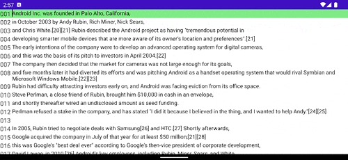
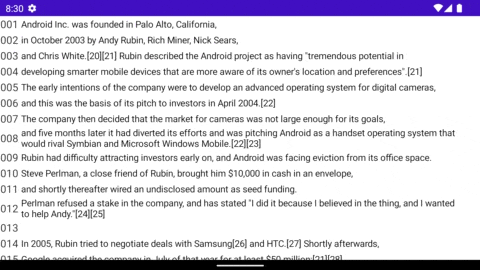
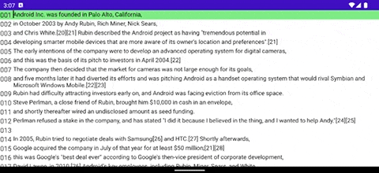

[](https://jitpack.io/#kaleidot725/text-editor-compose)
[](https://android-arsenal.com/api?level=24)
[](https://kotlinlang.org/)


<h1 align="center">
    Text Editor Compose
</h1>

<h3 align="center">
    A simple text editor for Jetpack Compose
</h3>

<h3 align="center">
    
</h3>

## ✨Features

- [x] Edit multiple line text
- [x] Insert and delete newline
- [x] Get selected line index
- [x] Display line number
- [x] Copy multiple line
- [x] Delete multiple line
- [x] Support physical keyboard

## 🪄Usage

This library is easy to use, just follow the steps below to add a dependency and write codes.

### Step 1: Add the JitPack repository to build.gradle

```groovy
allprojects {
	repositories {
		...
		maven { url 'https://jitpack.io' }
	}
}
```

### Step 2: Add the library to the dependencies

```groovy
dependencies {
	implementation 'com.github.kaleidot725:text-editor-compose:0.6.0'
}
```

### Step 3: Declare TextEditor & TextEditorState

```kotlin
class MainActivity : ComponentActivity() {
    @OptIn(ExperimentalComposeUiApi::class)
    override fun onCreate(savedInstanceState: Bundle?) {
        super.onCreate(savedInstanceState)
	
        setContent {
            SampleTheme {
                var textEditorState by remember { mutableStateOf(TextEditorState.create(DemoText)) }
		val bottomPaddingValue = with(LocalDensity.current) { WindowInsets.ime.getBottom(this).toDp() }
                val contentPaddingValues = PaddingValues(bottom = bottomPaddingValue)
		
                Box(modifier = Modifier.fillMaxSize().systemBarsPadding()) {
                    TextEditor(
                        textEditorState = textEditorState,
                        onChanged = { textEditorState = it },
                        contentPaddingValues = contentPaddingValues,
                    )
                }
            }
        }
    }
}
```

## 🧪Demo

Check out the demo code [here](https://github.com/kaleidot725/text-editor-compose/blob/main/app/src/main/java/jp/kaleidot725/sample/ui/composable/Demo.kt).

| No | Title | Movie |
| --- | ---- | ---- |
| 1 | Edit multiple line text |  |
| 2 | Insert and delete newline |  |
| 3 | Copy multiple line |  |
| 4 | Delete multiple line |  |

## 💡License


```
Copyright (c) 2022 Yusuke Katsuragawa

Permission is hereby granted, free of charge, to any person obtaining a copy
of this software and associated documentation files (the "Software"), to deal
in the Software without restriction, including without limitation the rights
to use, copy, modify, merge, publish, distribute, sublicense, and/or sell
copies of the Software, and to permit persons to whom the Software is
furnished to do so, subject to the following conditions:

The above copyright notice and this permission notice shall be included in all
copies or substantial portions of the Software.

THE SOFTWARE IS PROVIDED "AS IS", WITHOUT WARRANTY OF ANY KIND, EXPRESS OR
IMPLIED, INCLUDING BUT NOT LIMITED TO THE WARRANTIES OF MERCHANTABILITY,
FITNESS FOR A PARTICULAR PURPOSE AND NONINFRINGEMENT. IN NO EVENT SHALL THE
AUTHORS OR COPYRIGHT HOLDERS BE LIABLE FOR ANY CLAIM, DAMAGES OR OTHER
LIABILITY, WHETHER IN AN ACTION OF CONTRACT, TORT OR OTHERWISE, ARISING FROM,
OUT OF OR IN CONNECTION WITH THE SOFTWARE OR THE USE OR OTHER DEALINGS IN THE
SOFTWARE.
```
